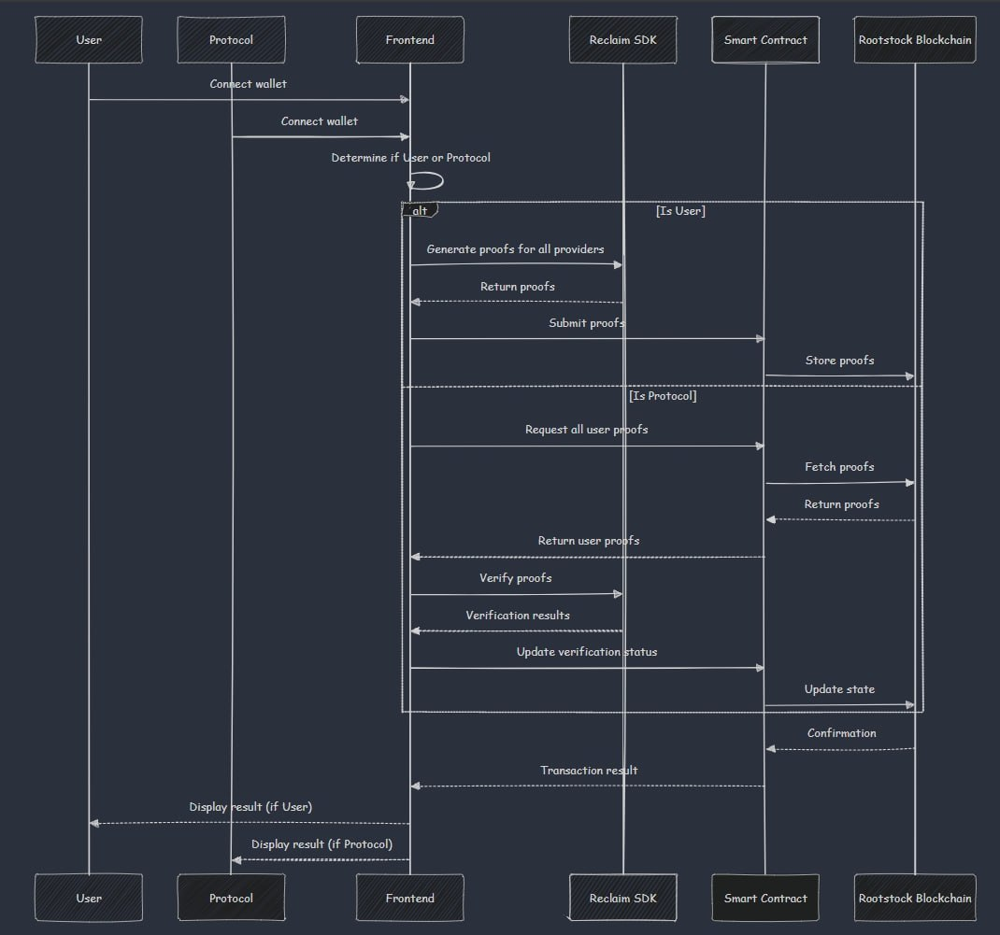

# Zk-Market

*  **Zk-Market** is a groundbreaking marketplace that bridges the gap between Web2 and Web3 ecosystems through the innovative use of zero-knowledge proofs. At its core, Zk-Market leverages **ZKtls (Zero-Knowledge Transport Layer Security)** to establish secure connections with Web3 networks. Our platform employs a proxy-based ZKtls system, enabling the generation of zero-knowledge proofs for any Web2 data, which can then be verified on any blockchain. By integrating Reclaim Protocol libraries, we facilitate the seamless transfer of Web2 data on-chain, unlocking new possibilities for marketplace interactions.

* The Zk-Market SDK serves as a secure channel for Web3 protocols to engage with both Web2 and Web3 protocols while adhering to customizable business logic. This unique integration allows for novel scenarios that benefit both ecosystems while faciliating the **trustless** service of the blockchain. For instance, Web3 protocols can now expand their user base beyond web3 users by partnering with Web2 platforms. Through this collaboration, Web3 protocols can offer airdrops or other incentives to early adopters from the Web2 world, effectively **bridging** the gap between these two digital realms.

* This strategy not only helps Web3 protocols to acquire and retain a broader user base but also provides value to Web2 platforms by incentivizing their users to engage with blockchain technology. As users from Web2 platforms are rewarded for their participation, they're more likely to remain active on both the Web2 platform and the partnered Web3 protocol. This symbiotic relationship fosters growth for both ecosystems simultaneously, creating a win-win situation that accelerates the adoption of blockchain technology while enhancing the value proposition of existing Web2 services.

# How to use it 

# Structure 

# Use Cases for Zk-Market:

* **Mass Adoption through Web2 Partnerships**

Zk-Market enables Web3 protocols to collaborate with major Web2 companies like JPMorgan or Facebook, creating innovative incentive structures. For example:
Business Logic: Users with 500+ followers on Facebook receive a specific amount of tokens from a partnering Web3 protocol.
Benefits:
Web3: Expands ecosystem by onboarding Web2 users to their blockchain.
Web2: Increases user retention as incentivized users are more likely to remain active on the platform.
Outcome: A win-win situation fostering growth in both Web2 and Web3 ecosystems.

* **Incentivizing Open-Source Contributors**

Zk-Market can verify and reward open-source contributions across various projects:
Process: Use ZKtls to securely verify a developer's contributions from their GitHub account.
Incentive Structure: Reward contributors based on their verified open-source work.
Benefits:
Attracts more skilled developers to the protocol.
Encourages ongoing contributions and community engagement.
Builds a strong, motivated developer ecosystem around the protocol.

* **Targeted Airdrops for Web2/web3 Communities**

Utilize Zk-Market for precise, community-specific airdrops:
Example: Airdrop tokens to the Spotify community for a music NFT project.
Implementation: Use ZKtls to verify Spotify user data (e.g., listening history, playlist curation, verifying ceredential) without compromising privacy.
Advantages:
Targets users already interested in the relevant field (e.g., music enthusiasts for a music NFT).
Creates a bridge between Web2 user bases and Web3 projects.
Enhances the relevance and effectiveness of airdrops. 

**Blogs**
https://www.nascent.xyz/idea/cryptos-airtag-moment
https://x.com/VitalikButerin/status/1828727585204842867?utm_source=tldrcrypto