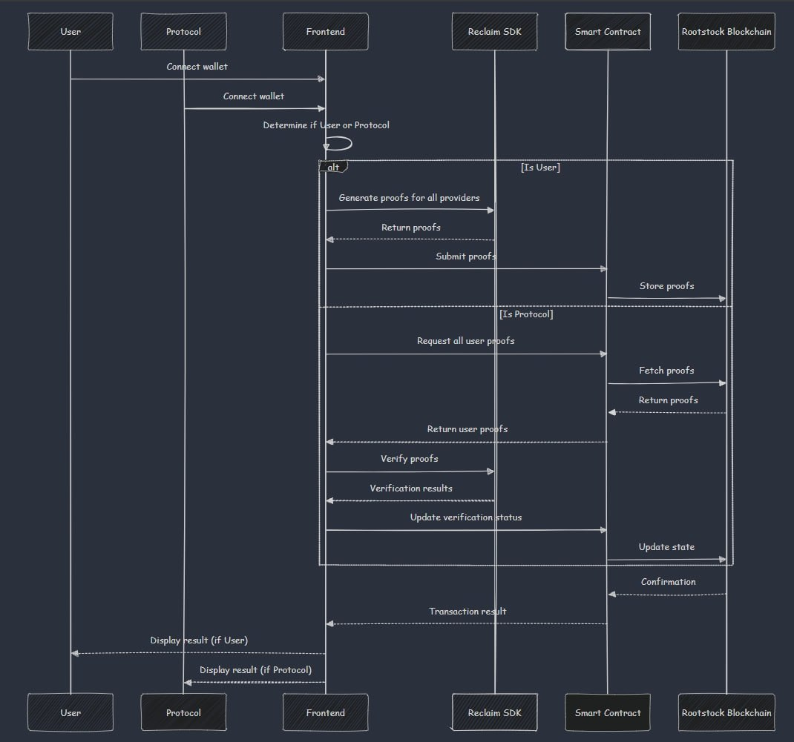

# zkDrop

**ETHGlobal Singapore 2024 - Winner: Rootstock Best Use**

zkDrop is a dApp that lets Web3 protocols run targeted airdrops to users verified by their Web2 credentials, using zero-knowledge proofs to preserve privacy.

## The Problem

Most airdrops target existing Web3 users. zkDrop solves the cold-start problem: how do you reward someone based on their GitHub contributions, Spotify listening history, or Gmail account, without them revealing that data on-chain and without trusting a centralised server?

## How It Works

zkDrop uses **ZkTLS** (via the [Reclaim Protocol](https://reclaimprotocol.org/)) to generate zero-knowledge proofs of Web2 data. The proof is verified and stored on the **Rootstock blockchain**, a Bitcoin sidechain with EVM compatibility.
```
User connects MetaMask
        ↓
Selects a Web2 provider (GitHub, Gmail, etc.)
        ↓
Scans a QR code on their phone
        ↓
Reclaim's proxy co-signs the TLS session and generates a ZK proof
        ↓
Proof is submitted to ReclaimVerifier smart contract on Rootstock
        ↓
Protocol dashboard verifies proof and checks airdrop eligibility
```

## Structure 



### ZkTLS in plain English

When your browser talks to a website over HTTPS, only you can see the response. ZkTLS routes that connection through a trusted proxy that co-signs the session, allowing a cryptographic proof to be generated that says *"this user received this response from this server"*, without revealing the actual data. That proof can be verified trustlessly by a smart contract.

## Architecture
```
frontend integ/          React frontend
├── src/
│   ├── App.js           Wallet connection, user/protocol routing
│   ├── contractConfig.js  ABI + Rootstock RPC config
│   ├── components/
│   │   ├── UserDashboard.js      Proof generation + QR code flow
│   │   └── ProtocolDashboard.js  User verification + eligibility view
│   └── contracts/       Compiled contract artifacts
scripts/                 Hardhat deployment scripts
artifacts/               Compiled contract build output
```

## Smart Contract: ReclaimVerifier

Deployed on **Rootstock Testnet**. Key functions:

| Function | Description |
|---|---|
| `submitProof(providerId, proof)` | User submits ZK proof on-chain |
| `verifyUser(userId, providerId)` | Protocol verifies a user's proof |
| `checkAirdropEligibility(userId)` | Returns whether a user is eligible |
| `getProviders()` | Lists available Web2 credential providers |
| `getUsers()` | Lists all users who have submitted proofs |

A companion `MyToken` (MTK) ERC20 contract handles the airdrop token.

## Tech Stack

- **Frontend**: React, ethers.js, react-qr-code
- **ZK Proofs**: [Reclaim Protocol](https://reclaimprotocol.org/) JS SDK (ZkTLS)
- **Blockchain**: Rootstock (RSK) - EVM-compatible Bitcoin sidechain
- **Smart Contracts**: Solidity 0.8.20, Hardhat, OpenZeppelin ERC20
- **Network**: Rootstock Testnet (`https://public-node.testnet.rsk.co`)

## Running Locally
```bash
cd "frontend integ"
npm install
npm start
```

You'll need MetaMask configured for the Rootstock Testnet:
- **RPC URL**: `https://public-node.testnet.rsk.co`
- **Chain ID**: `31`
- **Symbol**: `tRBTC`

## Known Limitations (MVP)

1. **App secret exposed on frontend**: signature generation should happen server-side in production. The `generateSignature` call in `UserDashboard.js` is a known MVP shortcut.
2. **Proof stored as raw JSON**: gas-inefficient. Production would store a hash on-chain and keep the full proof off-chain.
3. **Airdrop execution not implemented**: the contract tracks eligibility, but token distribution requires a separate claim or distribution function.
4. **Users require a MetaMask wallet**: the full vision (rewarding walletless Web2 users) would require a pre-funded claim contract redeemable at wallet creation time.

## Use Cases

**Mass adoption via Web2 partnerships**  
A Web3 protocol partners with a platform like Facebook - users with 500+ followers receive tokens. Both ecosystems benefit: Web3 grows its user base, Web2 increases retention.

**Rewarding open-source contributors**  
ZkTLS verifies GitHub contribution history without exposing private data. Protocols reward developers based on real, verified work, not self-reported claims.

**Targeted airdrops**  
A music NFT project airdrops tokens to verified Spotify listeners. ZkTLS confirms listening history without the user ever revealing their account credentials.

## Further Reading

- [Crypto's AirTag Moment](https://www.nascent.xyz/idea/cryptos-airtag-moment) — Nascent
- [Vitalik on ZkTLS use cases](https://x.com/VitalikButerin/status/1828727585204842867) — Twitter/X

## Hackathon

Built at [ETHGlobal Singapore 2024](https://ethglobal.com/showcase/zk-market-s6yp7) in 36 hours.  
Won **Rootstock — Best Use of Rootstock Blockchain**.


